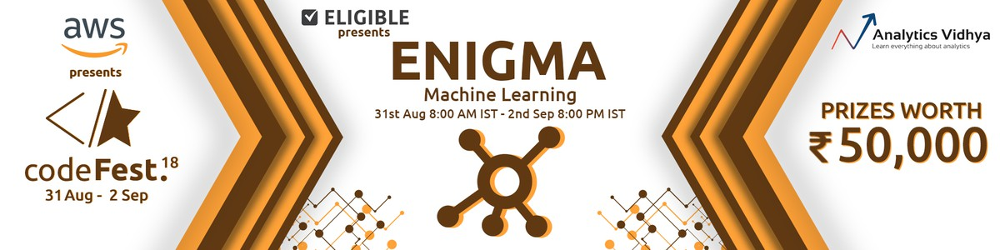
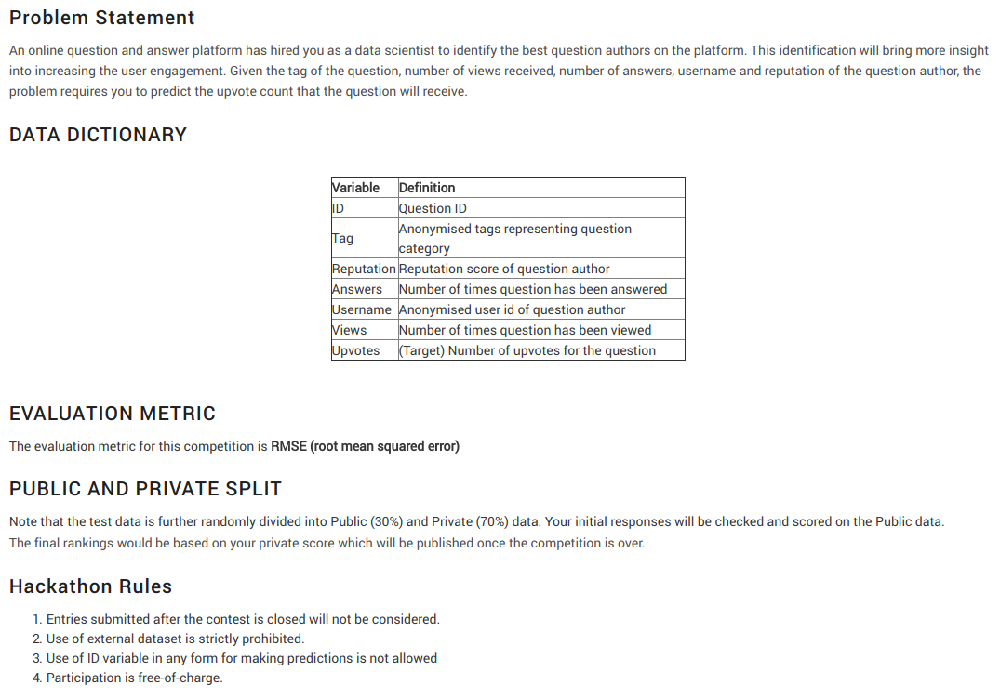

# AWS Enigma Codefest 2018, Analytics Vidhya:

- Secured 36th position in the public leaderboard among 910 participants in the contest.
- The task is to identify the best question authors on a Data Science question and answer platform. So given the data pertaining to the author and the question category, we have to predict the number of Upvotes the question will receive in the test set.
- Performed Feature Engineering(created a new dataset), implemented Bayesian Optimisation to tune the hyperparameters of the model and made the final prediction using XGBRegressor.

