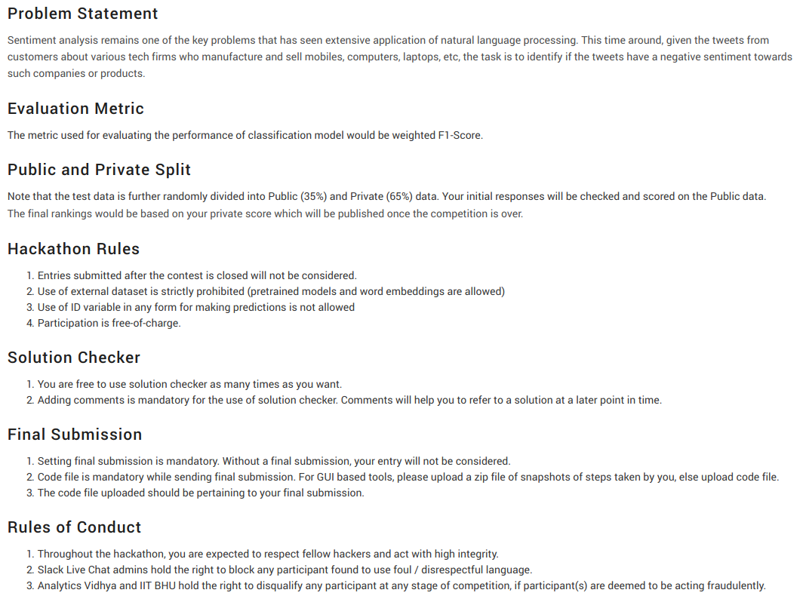

# Linguipedia, AWS Codefest 2018:
- The goal is to determine user's tweets which have negative sentiments towards a mobile and laptop manufacturing company.
- Performed Text Cleaning and used frequency based embedding techniques like Count Vectorizer and Tf-IDF Vectorizer to embed the text data. Finally, made predictions using both word level and character level embeddings as my features.
- Achieved an F1-score of 0.8364 using Logistic Regression and did hyperparameter tuning using cross-validation tactics.

## Rules and Description

