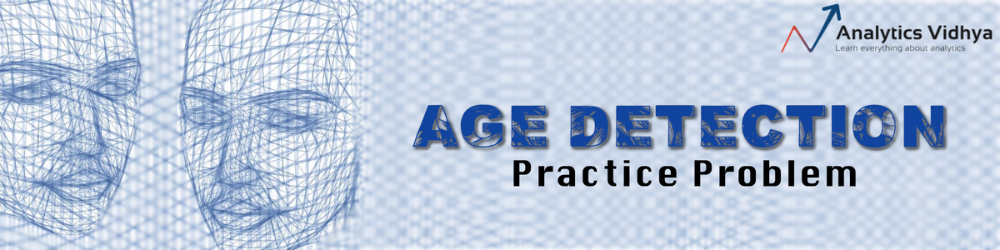
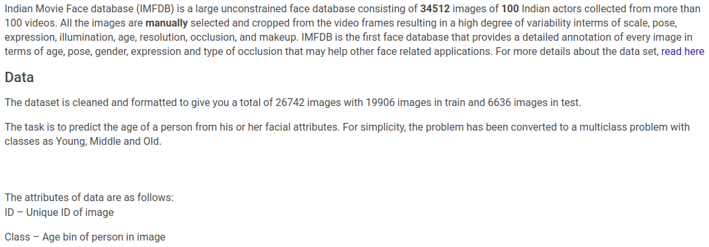

# Age Detection of Indian Actors

- Currently at 54th position among 5580 participants in the competition.
- The task is to predict the age of a person from his or her facial attributes. A multi-class image classification problem with classes as Young, Middle, and Old.
- Deep convolutional network architectures were used along with pre-processing and regularization 
(batch normalization, data augmentation, dropout etc.).  
- Results(Accuracy Score) were as follows:
    - Deep Neural Networks = 0.72
    - Deep CNN's = 0.82.

